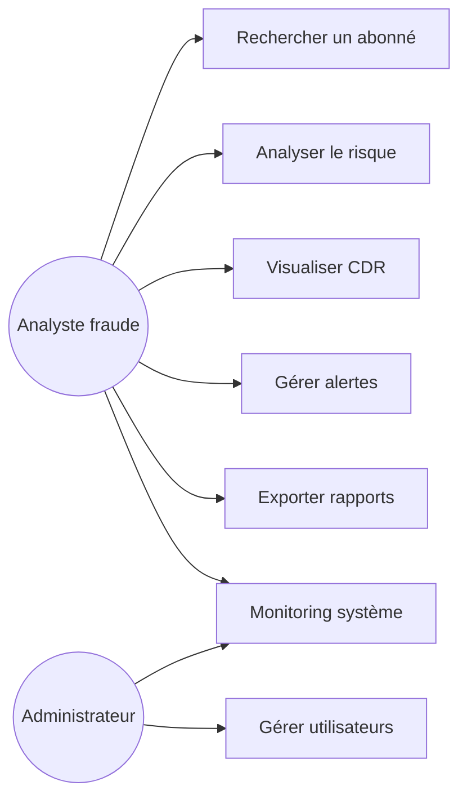
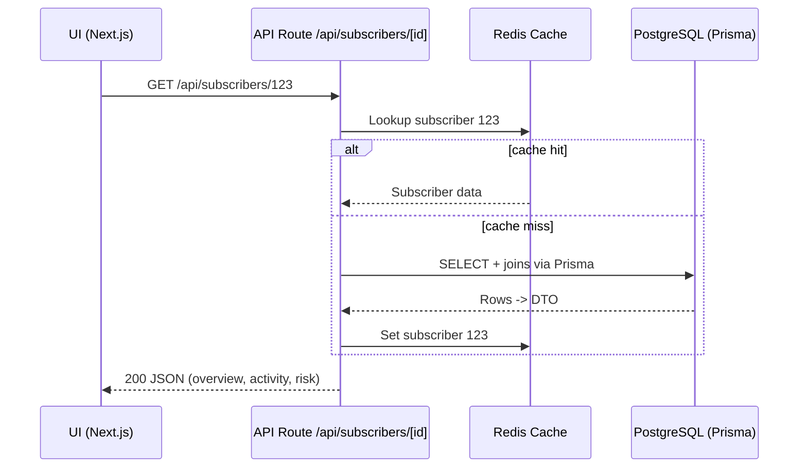
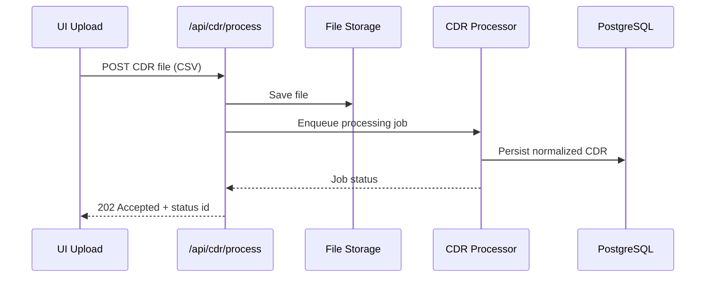
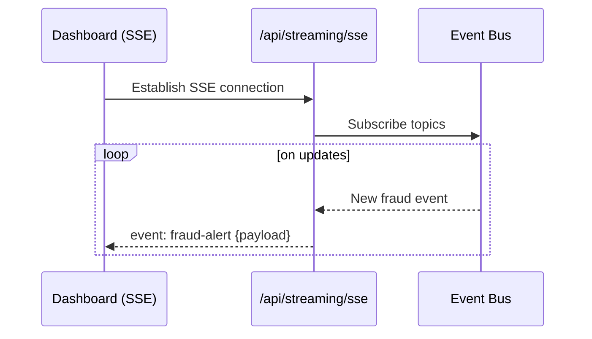
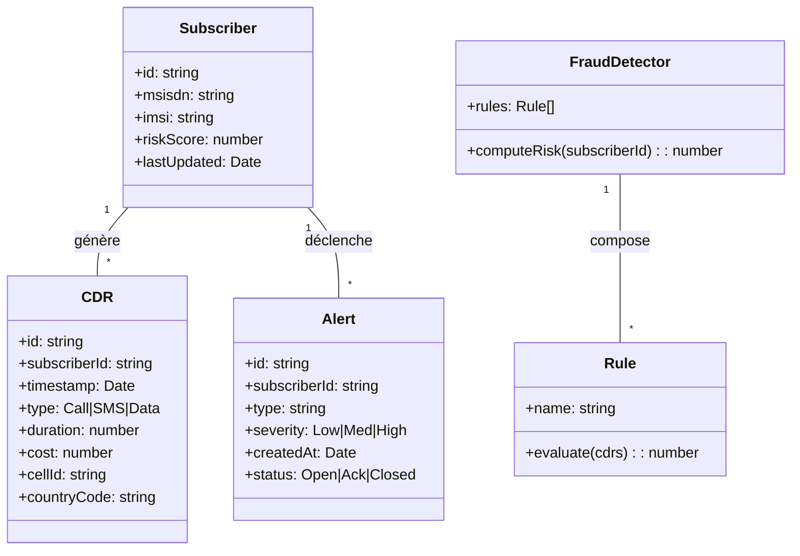

# Rapport de Stage — FraudGuard 360° (Télécom)

## Système de Détection et d’Analyse de Fraude

- **Organisation d’accueil**: ezi data
- **Projet**: FraudGuard 360° — Plateforme de détection de fraude télécom
- **Durée du stage**: 3 mois
- **Technologies principales**: Next.js 14, React 18, TypeScript 5, Prisma, PostgreSQL, Redis, Tailwind, Docker, Kubernetes, Prometheus, Grafana

---

## Table des matières

**Remerciements** ............................................................................................. I

**Résumé** ........................................................................................................ II

**Abstract** ....................................................................................................... III

**Table des figures** .......................................................................................... IV

**Liste des tableaux** ........................................................................................ V

**Table des matières** ....................................................................................... VI

**Introduction générale** .................................................................................... 1

---

### Chapitre 1 : Présentation générale du projet ................................................. 3

1.1 Introduction ................................................................................................ 3  
1.2 Présentation de l’organisme d’accueil ........................................................ 3  
 1.2.1 Description de l’entreprise .................................................................. 3  
 1.2.2 Prestations et domaines d’expertise .................................................... 4  
1.3 Cadre général du projet .............................................................................. 5  
 1.3.1 Présentation du projet .......................................................................... 5  
 1.3.2 Problématique ...................................................................................... 5  
 1.3.3 Solution ............................................................................................... 5  
 1.3.4 Mission ................................................................................................ 5  
1.4 Conduite du projet ..................................................................................... 6  
 1.4.1 Méthodologie adoptée — Gestion de Projet individuelle avec outils de suivi .... 6  
 1.4.2 Planification et organisation du projet .................................................. 8  
1.5 Conclusion ................................................................................................. 9

---

### Chapitre 2 : Analyse et conception .................................................................. 10

2.1 Introduction .............................................................................................. 10  
2.2 Étude Fonctionnelle ................................................................................. 10  
2.3 Spécification des besoins fonctionnels ..................................................... 10  
2.4 Spécification des besoins non-fonctionnels .............................................. 10  
2.5 Analyse des besoins ................................................................................. 10  
 2.5.1 Diagramme de cas d’utilisation ............................................................. 11  
 2.5.2 Analyse des cas d’utilisation ................................................................. 11  
 2.5.3 Diagrammes de séquence système ....................................................... 14  
2.6 Étude Conceptuelle .................................................................................. 17  
 2.6.1 Diagrammes de classes ........................................................................ 17  
 2.6.2 Diagrammes de séquence détaillés ..................................................... 23  
 2.6.3 Diagrammes d’activités ........................................................................ 26  
2.7 Conclusion ............................................................................................... 29

---

### Chapitre 3 : Étude technique .......................................................................... 31

3.1 Introduction ............................................................................................. 31  
3.2 Environnement de Développement ........................................................... 31  
 3.2.1 IDE (Integrated Development Environment) .......................................... 31  
 3.2.2 Serveurs de Développement ................................................................ 32  
3.3 Choix des Technologies ............................................................................ 33  
 3.3.1 Langages de Programmation ................................................................ 33  
 3.3.2 Frameworks et Bibliothèques ............................................................... 35  
3.4 Conclusion .............................................................................................. 36

---

### Chapitre 4 : Réalisation ................................................................................. 37

4.1 Introduction ............................................................................................ 37  
4.2 Développement des Fonctionnalités ........................................................ 37  
4.3 Intégration des Composants .................................................................... 39  
4.4 Défis Rencontrés et Solutions ................................................................. 39  
4.5 Documentation et Suivi ........................................................................... 40  
4.6 Conclusion ............................................................................................. 40

---

## Conclusion et perspectives .............................................................................. I

- Conclusion .................................................................................................... I
- Perspectives .................................................................................................. I

## Bibliographie .................................................................................................. I

---

## Remerciements

Je remercie chaleureusement l’équipe d’« ezi data » pour son accueil, son encadrement et la qualité des échanges au cours de ces 3 mois. Merci à mon superviseur pour ses conseils techniques et méthodologiques, ainsi qu’à mes collègues pour leur disponibilité et leur bienveillance.

---

## Résumé

Ce rapport présente la conception et la réalisation de « FraudGuard 360° », une plateforme de détection et d’analyse de fraude télécom développée lors d’un stage de 3 mois au sein d’« ezi data ». L’application offre la visualisation des CDR (Call Detail Records), la détection des patterns suspects, l’évaluation du risque, la diffusion d’alertes et un tableau de bord interactif. L’architecture repose sur Next.js (frontend + API), Prisma/PostgreSQL pour la persistance, Redis pour la mise en cache, et une pile d’observabilité Prometheus/Grafana. La solution est containerisable (Docker) et prête pour l’orchestration (Kubernetes).

Mots-clés: Détection de fraude, Télécom, CDR, Next.js, TypeScript, Prisma, PostgreSQL, Redis, Prometheus, Grafana.

---

## Abstract

This report presents the design and implementation of “FraudGuard 360°,” a telecom fraud detection and analytics platform developed during a 3-month internship at “ezi data.” The application provides CDR visualization, suspicious pattern detection, risk scoring, alerting, and an interactive dashboard. The architecture uses Next.js (frontend + API), Prisma/PostgreSQL for persistence, Redis for caching, and Prometheus/Grafana for observability. The solution is containerized (Docker) and ready for orchestration (Kubernetes).

Keywords: Fraud detection, Telecom, CDR, Next.js, TypeScript, Prisma, PostgreSQL, Redis, Prometheus, Grafana.

---

## Table des figures

- Figure 1: Diagramme de cas d’utilisation — acteurs et fonctionnalités clés
- Figure 2: Diagramme de séquence — Analyse abonné (API)
- Figure 3: Diagramme de séquence — Traitement CDR
- Figure 4: Diagramme de séquence — Streaming temps réel (SSE)
- Figure 5: Diagramme de classes — Modèle conceptuel
- Figure 6: Diagramme d’activités — Pipeline de détection

## Liste des tableaux

- Tableau 1: Endpoints API de production
- Tableau 2: Technologies et outils principaux
- Tableau 3: Environnements et déploiement

---

## Introduction générale

La fraude télécom demeure un enjeu majeur pour les opérateurs avec l’augmentation du trafic voix/SMS/data et la sophistication des techniques (SIM swap, IRSF, bypass, fraude d’itinérance, etc.). Le projet « FraudGuard 360° » vise à fournir une base solide de visualisation, d’analyse et de détection en temps (quasi) réel, soutenue par une architecture moderne et observable.

Objectifs généraux:

1. Mettre en place une application web moderne et performante (Next.js + TypeScript).
2. Visualiser les CDR et les indicateurs de risques dans un tableau de bord.
3. Implémenter des mécanismes de détection (règles/heuristiques) et d’alerting.
4. Prévoir la scalabilité, la sécurité et l’observabilité en production.

---

# Chapitre 1 : Présentation générale du projet

## 1.1 Introduction

Ce chapitre présente l’organisation d’accueil, le contexte, la problématique métier et la solution proposée, ainsi que la méthodologie de conduite de projet.

## 1.2 Présentation de l’organisme d’accueil

### 1.2.1 Description de l’entreprise

« ezi data » est une organisation spécialisée dans les solutions data/analytics, intégrant des pratiques modernes de développement et d’industrialisation logicielle. L’entreprise met l’accent sur l’ingénierie de données, l’analytique avancée et l’aide à la décision au service des secteurs à forte volumétrie (dont les télécoms).

### 1.2.2 Prestations et domaines d’expertise

- Ingénierie de données (ETL/ELT, data pipelines)
- Analytics et visualisation (dashboards interactifs)
- Détection de fraude et conformité (règles, scoring)
- Industrialisation (CI/CD, conteneurisation, orchestration)

## 1.3 Cadre général du projet

### 1.3.1 Présentation du projet

FraudGuard 360° est une plateforme prototype permettant:

- La recherche d’abonnés (MSISDN/IMSI) et l’analyse consolidée.
- La détection de patterns suspects (vitesse, géo-anomalies, premium rate, device swapping).
- La visualisation (cartes, graphiques) et l’export de rapports.
- Le monitoring système et la diffusion d’événements en temps réel (SSE).

### 1.3.2 Problématique

- Volumétrie élevée et évolutive des CDR.
- Détection rapide avec faible faux positifs.
- Conformité et sécurité (chiffrement, RGPD).
- Observabilité et retour d’expérience en production.

### 1.3.3 Solution

- Next.js (frontend + API) pour unifier UI et endpoints.
- Prisma + PostgreSQL pour la persistance structurée.
- Redis pour cache/session et temps de réponse.
- Docker/Kubernetes pour la scalabilité et la portabilité.
- Prometheus/Grafana pour le suivi, l’alerte, et l’amélioration continue.

### 1.3.4 Mission

- Concevoir l’architecture logicielle et le modèle de données.
- Implémenter les fonctionnalités clés (recherche, scoring, alertes, visualisation).
- Mettre en place CI/CD, sécurité de base et observabilité.
- Documenter et livrer un prototype prêt pour l’industrialisation.

## 1.4 Conduite du projet

### 1.4.1 Méthodologie adoptée — Gestion de Projet individuelle avec outils de suivi

- **Approche**: itérative/incrémentale, timeboxing hebdomadaire.
- **Planification & suivi**: backlog GitHub Issues, milestones, Kanban.
- **Qualité**: ESLint/Prettier, tests Jest/RTL, type-checking strict.
- **Documentation**: dossier `docs/` (architecture, API, déploiement, sécurité).

### 1.4.2 Planification et organisation du projet

- Sprint 1: Setup, scaffolding Next.js, stack de base, pages de démonstration.
- Sprint 2: Composants UI, recherche, dashboard, mock-data réalistes.
- Sprint 3: Endpoints API, traitement CDR, scoring, SSE.
- Sprint 4: Sécurité (auth, rate-limit), observabilité, packaging Docker.
- Sprint 5: Documentation, tests, refinements et démo.

## 1.5 Conclusion

Le cadrage a permis d’aligner les objectifs techniques et métiers, de structurer un plan d’exécution et de poser les bases d’une solution évolutive.

---

# Chapitre 2 : Analyse et conception

## 2.1 Introduction

Ce chapitre présente l’analyse fonctionnelle et technique, les besoins et les modèles (UML) associés.

## 2.2 Étude Fonctionnelle

- Recherche d’abonné (MSISDN/IMSI) et vue 360°.
- Scoring de risque et alertes.
- Filtres avancés (périodes, localisation, types d’événements).
- Monitoring temps réel et export (CSV/PDF).

## 2.3 Spécification des besoins fonctionnels

- Gestion de l’authentification (JWT) et des sessions (Redis).
- Endpoints de consultation: `/api/subscribers/[id]`.
- Détection de fraude: `/api/fraud/detect/[id]`.
- Traitement CDR: `/api/cdr/process`.
- Streaming SSE: `/api/streaming/sse`.
- Monitoring: `/api/monitoring/performance`, `/api/health`.

## 2.4 Spécification des besoins non-fonctionnels

- **Sécurité**: chiffrement, validation d’entrées, RBAC (évolution).
- **Performance**: temps de réponse < 300 ms pour requêtes courantes (cible).
- **Scalabilité**: horizontal scaling (pods), cache Redis, pooling DB.
- **Disponibilité**: health checks, alerting, redondance (évolution).
- **Observabilité**: métriques, logs, traces (roadmap).
- **Qualité**: lint, tests, CI/CD.

## 2.5 Analyse des besoins

### 2.5.1 Diagramme de cas d’utilisation (Figure 1)



### 2.5.2 Analyse des cas d’utilisation (extraits)

- **Rechercher un abonné**: saisie MSISDN/IMSI → agrégation des informations → affichage dashboard.
- **Analyser le risque**: calcul de score sur base d’heuristiques (vitesse, géo, premium, device).
- **Gérer alertes**: lister, accuser réception, export.
- **Exporter**: générer PDF/CSV des vues analytiques.
- **Monitoring**: visualiser métriques système et perf endpoints.

### 2.5.3 Diagrammes de séquence système

Figure 2 — Analyse abonné (API):



Figure 3 — Traitement CDR:



Figure 4 — Streaming temps réel (SSE):



## 2.6 Étude Conceptuelle

### 2.6.1 Diagrammes de classes (Figure 5)



### 2.6.2 Diagrammes de séquence détaillés

- Détail des règles (évaluation séquentielle, agrégation par pondération, seuils dynamiques).
- Interaction avec cache Redis pour éviter les recalculs.

### 2.6.3 Diagrammes d’activités (Figure 6)

```mermaid
flowchart TD
  A[Ingestion CDR] --> B[Validation & parsing]
  B -->|ok| C[Normalisation]
  B -->|erreur| E[Journaliser + rejeter]
  C --> D[Persistance (Prisma -> PostgreSQL)]
  D --> F[Détection heuristique]
  F --> G{Score > seuil?}
  G -- Oui --> H[Générer alerte]
  G -- Non --> I[Fin]
  H --> J[Notifier (SSE)]
  J --> I[Fin]
```

## 2.7 Conclusion

L’analyse a fourni une base claire des exigences, des interactions et des modèles, garantissant la cohérence entre besoins métier et design technique.

---

# Chapitre 3 : Étude technique

## 3.1 Introduction

Ce chapitre décrit l’environnement, les choix technologiques et les contraintes techniques.

## 3.2 Environnement de Développement

### 3.2.1 IDE

- **IDE**: Cursor 1.99.3
- **Langage**: TypeScript 5
- **Lint/Format**: ESLint, Prettier
- **Tests**: Jest + React Testing Library

### 3.2.2 Serveurs de Développement

- **Next.js Dev Server**: `npm run dev` (port 3000)
- **Docker Compose**: application + PostgreSQL + Redis + Nginx (selon `docker-compose.yml`)

## 3.3 Choix des Technologies

### 3.3.1 Langages de Programmation

- TypeScript (front/back)
- SQL (PostgreSQL)

### 3.3.2 Frameworks et Bibliothèques

- Frontend: Next.js 14.1.0 (React 18.2), Tailwind, shadcn/ui
- Backend/API: Next.js API Routes, Zod (validation), JWT
- ORM/DB: Prisma 5.22, PostgreSQL
- Cache: Redis
- Observabilité: Prometheus, Grafana, Winston
- DevOps: Docker, Kubernetes (manifests `k8s/`), GitHub Actions (CI/CD)

Tableau 1 — Endpoints API de production:

| Endpoint                      | Description                          |
| ----------------------------- | ------------------------------------ |
| `/api/subscribers/[id]`       | Données complètes d’un abonné        |
| `/api/fraud/detect/[id]`      | Détection de fraude en temps réel    |
| `/api/cdr/process`            | Traitement de fichiers CDR           |
| `/api/streaming/sse`          | Streaming d’événements en temps réel |
| `/api/monitoring/performance` | Métriques de performance             |
| `/api/health`                 | Health checks                        |
| `/api/auth/*`                 | Authentification JWT                 |

Tableau 2 — Technologies et outils principaux:

| Catégorie     | Outils                              |
| ------------- | ----------------------------------- |
| Frontend      | Next.js, React, Tailwind, shadcn/ui |
| Backend       | Next.js API Routes, Zod, JWT        |
| Données       | Prisma, PostgreSQL                  |
| Cache         | Redis                               |
| Observabilité | Prometheus, Grafana, Winston        |
| Qualité       | ESLint, Prettier, Jest              |
| DevOps        | Docker, Kubernetes, GitHub Actions  |

Tableau 3 — Environnements:

| Environnement | Caractéristiques                       |
| ------------- | -------------------------------------- |
| Développement | Mock data, hot reload, debug           |
| Staging       | Données réalistes, tests d’intégration |
| Production    | Scale-out, monitoring, alerting        |

## 3.4 Conclusion

Les choix technologiques soutiennent la performance, la sécurité et l’évolutivité du système, tout en simplifiant le cycle de développement.

---

# Chapitre 4 : Réalisation

## 4.1 Introduction

Ce chapitre présente les éléments développés, l’intégration et les obstacles rencontrés.

## 4.2 Développement des Fonctionnalités

- Pages et composants clés: `src/app`, `src/components/*` (dashboard, filtres, export, cartes, graphiques).
- Logique métier: `src/lib/*` (fraude, CDR, sécurité, streaming).
- Types & contrats: `src/types/*`.
- Tests: `__tests__/*`.

## 4.3 Intégration des Composants

- Intégration UI (shadcn/ui, Tailwind) avec state management via hooks.
- Intégration API (Next.js routes) et orchestrations simples (services lib/\*).
- Intégration cache (Redis) et persistance (Prisma/PostgreSQL) — production mode.

## 4.4 Défis Rencontrés et Solutions

- Performance UI: optimisation SSR/CSR, mémoïsation, pagination.
- Typage strict: harmonisation des interfaces TypeScript.
- Traitement fichiers CDR: validation robuste, gestion d’erreurs, reprise.
- SSE: stabilité des connexions, reprise en cas de défaillance réseau.
- Sécurité: validation d’entrée (Zod), headers de sécurité, auth basique JWT.

## 4.5 Documentation et Suivi

- Documentation centralisée: `docs/` (architecture, API, opérations, sécurité, développement).
- Scripts de déploiement: `scripts/` et CI/CD GitHub Actions.
- Monitoring: dashboards Grafana, métriques Prometheus, alertes de base.

## 4.6 Conclusion

Le prototype livré démontre une base solide pour l’analyse et la détection de fraude télécom avec une architecture moderne et industrialisable.

---

# Conclusion et perspectives

## Conclusion

Au terme de 3 mois, le projet a permis la mise en place d’un socle applicatif robuste, intégrant visualisation, détection initiale, streaming d’événements, sécurité de base et observabilité.

## Perspectives

- Intégration de données temps réel (Kafka) et ML avancé (modèles supervisés).
- RBAC fin, audits étendus, chiffrement renforcé et rotation des clés.
- Scalabilité avancée (read replicas DB, sharding Redis, CDN, edge).
- Microservices progressifs et API Gateway dédié.
- Tests E2E, chaos engineering, SLO/SLI.

---

# Bibliographie

- Next.js Documentation — https://nextjs.org/docs
- React Documentation — https://react.dev
- TypeScript Handbook — https://www.typescriptlang.org
- Prisma Documentation — https://www.prisma.io/docs
- Redis Documentation — https://redis.io/docs
- Prometheus Documentation — https://prometheus.io/docs
- Grafana Documentation — https://grafana.com/docs/
- OWASP ASVS — https://owasp.org/www-project-application-security-verification-standard/
- Règlement Général sur la Protection des Données (RGPD) — https://eur-lex.europa.eu/
